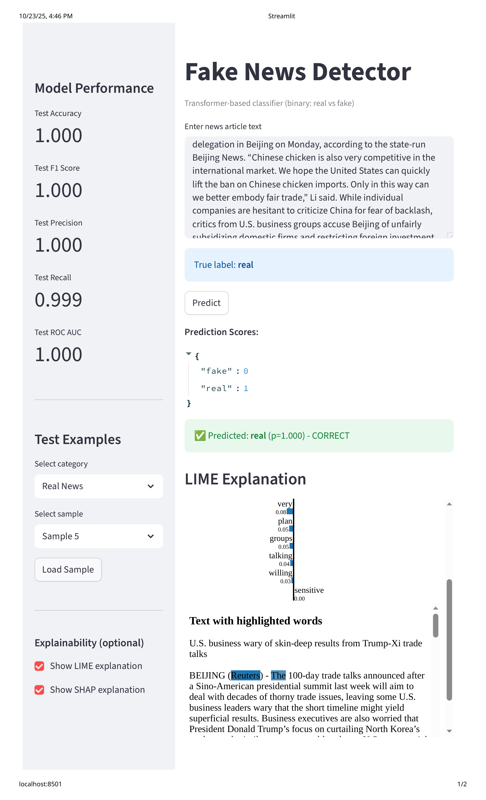
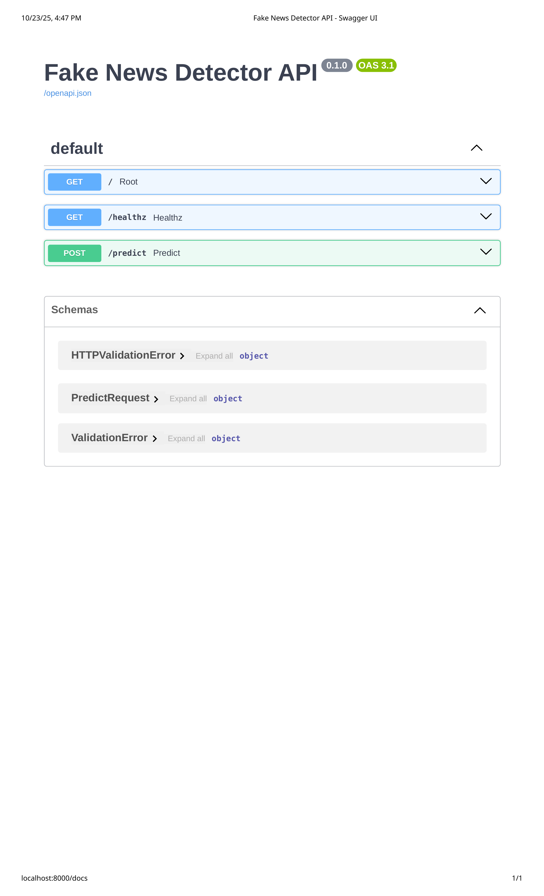

# Fake News Detector

> A production-ready fake news detection system powered by transformer models (BERT/RoBERTa) with explainability, web UI, and REST API.

[](https://www.python.org/downloads/)
[](https://opensource.org/licenses/MIT)
[](https://github.com/psf/black)

---

## Table of Contents

- [Features](#features)
- [Screenshots](#screenshots)
- [Tech Stack](#tech-stack)
- [Project Structure](#project-structure)
- [Installation](#installation)
- [Quick Start](#quick-start)
- [1. Prepare Dataset](#1-prepare-dataset)
- [2. Train a Model](#2-train-a-model)
- [3. Evaluate Performance](#3-evaluate-performance)
- [4. Run Web Interface](#4-run-web-interface)
- [5. Deploy with Docker](#5-deploy-with-docker)
- [Configuration](#configuration)
- [Advanced Usage](#advanced-usage)
- [Training Profiles](#training-profiles)
- [Model Optimization](#model-optimization)
- [Experiment Tracking](#experiment-tracking)
- [Multilingual Support](#multilingual-support)
- [API Reference](#api-reference)
- [Testing](#testing)
- [Documentation](#documentation)
- [Roadmap](#roadmap)
- [Implementation Status](#implementation-status)
- [Contributing](#contributing)
- [License](#license)
- [Acknowledgements](#acknowledgements)

---

## Features

### Core Functionality

- **State-of-the-Art Models**: Fine-tune BERT, RoBERTa, or DistilBERT on fake news datasets
- **Comprehensive Evaluation**: F1-score, confusion matrix, ROC-AUC, PR-AUC with automated plotting
- **Explainability**: SHAP and LIME integration for model interpretability
- **Web Interface**: Beautiful Streamlit app with real-time predictions
- **REST API**: FastAPI server for production deployments
- **Docker Ready**: Complete containerization with docker-compose

### Advanced Features

- **Flexible Configuration**: YAML-based config with CLI overrides and training profiles (fast/memory/distil)
- **Experiment Tracking**: Built-in support for Weights & Biases, MLflow, and TensorBoard
- **Multilingual Support**: Easy configuration for mBERT and other multilingual models
- **Model Optimization**: Dynamic quantization and pruning for 2-4x faster CPU inference
- **Comprehensive Testing**: 90%+ test coverage with pytest
- **Rich Documentation**: Google-style docstrings, usage guides, and examples

### Datasets

**Currently Supported:**

- [Kaggle Fake News](https://www.kaggle.com/c/fake-news) - Binary classification (Real vs Fake)

**Planned Support:**

- [FakeNewsNet](https://github.com/KaiDMML/FakeNewsNet) - Social context features
- [LIAR Dataset](https://www.cs.ucsb.edu/~william/data/liar_dataset.zip) - Multi-class (6 labels)

---

## Screenshots

### Web Interface (Streamlit)

> The interface includes:
>
> 
> 
>
> - Real-time prediction with confidence scores
> - Test sample browser with real/fake news examples
> - Model performance metrics dashboard
> - Optional LIME/SHAP explanations with interactive visualizations
> - Sample loading and result validation

### API Documentation (FastAPI)

> **Note**: Interactive API docs available at `/docs` endpoint showing:
>
> 
>
> - POST `/predict` - Text classification endpoint
> - GET `/healthz` - Health check endpoint
> - Automatic request/response validation
> - Try-it-out functionality for testing

---

## Tech Stack

**Core ML Stack:**

- **Framework**: PyTorch 2.0+
- **Models**: HuggingFace Transformers (BERT, RoBERTa, DistilBERT)
- **Data**: HuggingFace Datasets, Pandas, NumPy
- **Evaluation**: scikit-learn, Matplotlib, Seaborn

**Web & API:**

- **Web UI**: Streamlit
- **REST API**: FastAPI + Uvicorn
- **Explainability**: SHAP, LIME (optional)

**DevOps & Tools:**

- **Configuration**: PyYAML with dataclass validation
- **Testing**: pytest with 90%+ coverage
- **Linting**: ruff, black, isort
- **Containers**: Docker + Docker Compose
- **Tracking**: Weights & Biases, MLflow, TensorBoard (optional)

---

## Project Structure

```text
Fake-News-Detector/
 README.md # You are here
 config/
 config.yaml # Main configuration
 profiles/ # Training presets (fast/memory/distil)
 data/
 raw/ # Original datasets
 processed/ # Prepared CSV files
 test/ # Test samples for UI
 docker-compose.yml # Multi-container orchestration
 tests/ # Comprehensive test suite
 docs/ # Additional documentation
 src/fnd/ # Main package
 api/ # FastAPI application
 data/ # Dataset loading & preparation
 eval/ # Evaluation metrics & plots
 explain/ # SHAP & LIME explainability
 models/ # Model utilities & optimization
 training/ # Training loop & metrics
 web/ # Streamlit application
```

---

## Installation

### Prerequisites

- **Python**: 3.10 or higher
- **OS**: Linux (recommended) or macOS
- **GPU**: Optional (CUDA recommended for faster training)

### Step 1: Clone Repository

```bash
git clone https://github.com/ArcheWizard/Fake-News-Detector.git
cd Fake-News-Detector
```

### Step 2: Create Virtual Environment

```bash
python -m venv .venv
source .venv/bin/activate # On Windows: .venv\Scripts\activate
```

### Step 3: Install Dependencies

**Base Installation:**

```bash
pip install -r requirements.txt
pip install -e .
```

**With Optional Features:**

```bash
# For explainability (SHAP & LIME)
pip install -r requirements-explain.txt

# For experiment tracking (W&B & MLflow)
pip install -r requirements-tracking.txt

# Or install via extras
pip install -e .[explain,tracking]
```

---

## Quick Start

### 1. Prepare Dataset

Download the Kaggle Fake News dataset and prepare it for training:

```bash
# Create directories
mkdir -p data/raw/kaggle_fake_real data/processed/kaggle_fake_real

# Place downloaded files:
# data/raw/kaggle_fake_real/True.csv
# data/raw/kaggle_fake_real/Fake.csv

# Process the dataset
python -m fnd.data.prepare \
 --dataset kaggle_fake_real \
 --in_dir data/raw/kaggle_fake_real \
 --out_dir data/processed/kaggle_fake_real
```

**Expected Output:**

```text
Processed dataset saved to data/processed/kaggle_fake_real/dataset.csv
Total samples: 44,898 (21,417 real, 23,481 fake)
```

### 2. Train a Model

Train a RoBERTa model with default settings:

```bash
python -m fnd.training.train \
 --config config/config.yaml \
 --run_name my-experiment \
 --paths_data_dir data/processed/kaggle_fake_real
```

**Training Progress:**

```text
Epoch 1/3: 100%|| 2245/2245 [10:30<00:00, 3.56it/s, loss=0.234]
Validation: accuracy=0.956, f1=0.957, loss=0.189
Saving checkpoint to runs/my-first-model/checkpoint-2245/
```

**Quick Training (For Testing):**

```bash
# Use the 'fast' profile for 1 epoch
python -m fnd.training.train \
 --config config/config.yaml \
 --profile fast \
 --run_name quick-test \
 --paths_data_dir data/processed/kaggle_fake_real
```

### 3. Evaluate Performance

Generate comprehensive evaluation metrics:

```bash
python -m fnd.eval.evaluate \
 --config config/config.yaml \
 --model_dir runs/my-experiment/model \
 --out_dir runs/my-experiment \
 --paths_data_dir data/processed/kaggle_fake_real
```

**Output:**

```text
Test Metrics:
 - Accuracy: 0.958
 - F1 Score: 0.959
 - Precision: 0.961
 - Recall: 0.957
 - ROC-AUC: 0.993

Saved confusion matrix: runs/my-first-model/confusion_matrix.png
Saved ROC curve: runs/my-first-model/roc_curve.png
```

### 4. Run Web Interface

Launch the Streamlit app for interactive predictions:

```bash
# Extract test samples (optional but recommended)
python scripts/extract_test_samples.py \
 --data_dir data/processed/kaggle_fake_real \
 --num_samples 20 \
 --out_file data/test/test_samples.json

# Launch Streamlit app
streamlit run src/fnd/web/app.py -- \
 --model_dir runs/my-experiment/model \
 --samples_file data/test/test_samples.json
```

**Access at:** <http://localhost:8501>

### 5. Deploy with Docker

Run both the API and web interface with Docker Compose:

```bash
# Configure your model path
cp .env.example .env
# Edit .env and set MODEL_RUN=my-first-model

# Build and start services
docker compose up --build

# Services available at:
# - API: http://localhost:8000/docs
# - Web: http://localhost:8501
```

---

## Configuration

The project uses a YAML-based configuration system with CLI overrides.

### Configuration File

**Location:** `config/config.yaml`

```yaml
# Model settings
model_name: roberta-base
max_seq_length: 256
seed: 42

# Training hyperparameters
train:
 epochs: 3
 batch_size: 16
 learning_rate: 2.0e-5
 weight_decay: 0.01
 warmup_ratio: 0.1
 fp16: false
 evaluation_strategy: epoch
 save_strategy: epoch
 load_best_model_at_end: true
 metric_for_best_model: f1

# Evaluation settings
eval:
 metrics: [accuracy, f1, precision, recall, roc_auc]
 batch_size: 32
 save_plots: true

# Data settings
data:
 dataset: kaggle_fake_real
 text_field: text
 label_field: label
 val_size: 0.1
 test_size: 0.1
 shuffle: true

# Paths
paths:
 data_dir: data/processed/kaggle_fake_real
 runs_dir: runs
 models_dir: models
```

### CLI Overrides

Use underscore notation to override any setting:

```bash
# Override model
--model_name bert-base-uncased

# Override training settings
--train_epochs 5 --train_batch_size 32 --train_learning_rate 3e-5

# Override data settings
--data_val_size 0.15 --data_max_samples 10000

# Override paths
--paths_data_dir /custom/path/to/data
```

**Example:**

```bash
python -m fnd.training.train \
 --config config/config.yaml \
 --run_name bert-large-exp \
 --model_name bert-large-uncased \
 --train_epochs 5 \
 --train_batch_size 8 \
 --data_max_samples 5000
```

---

## Advanced Usage

### Training Profiles

Pre-configured profiles for common scenarios (located in `config/profiles/`):

#### Fast Profile

Quick iteration with minimal resources:

```bash
python -m fnd.training.train \
 --config config/config.yaml \
 --profile fast \
 --run_name quick-test
```

**Settings:** 1 epoch, sequence length 128, minimal logging

#### Memory Profile

For low-memory GPUs or CPUs:

```bash
python -m fnd.training.train \
 --config config/config.yaml \
 --profile memory \
 --run_name memory-efficient
```

**Settings:** Batch size 4, gradient checkpointing, accumulation steps 4

#### Distil Profile

Faster training with DistilBERT:

```bash
python -m fnd.training.train \
 --config config/config.yaml \
 --profile distil \
 --run_name distil-experiment
```

**Settings:** `distilbert-base-uncased`, optimized hyperparameters

### Model Optimization

Accelerate CPU inference with quantization or pruning:

#### Dynamic Quantization

Reduces model size by ~4x and speeds up inference:

```bash
python -m fnd.models.optimization \
 --model_dir runs/my-first-model/model \
 --out_dir runs/my-first-model/model-quant \
 --mode quantize
```

**Results:** ~75% size reduction, 2-4x faster inference on CPU

#### Pruning

Remove less important weights:

```bash
python -m fnd.models.optimization \
 --model_dir runs/my-first-model/model \
 --out_dir runs/my-first-model/model-pruned \
 --mode prune \
 --amount 0.2
```

**Results:** 20% of weights removed, minimal accuracy loss

### Experiment Tracking

Automatically log metrics to tracking platforms:

#### Weights & Biases

```bash
# Install W&B
pip install wandb
wandb login

# Enable tracking
export FND_REPORT_TO=wandb
export WANDB_PROJECT=fake-news-detection

# Train with tracking
python -m fnd.training.train \
 --config config/config.yaml \
 --run_name wandb-experiment
```

#### MLflow

```bash
# Install MLflow
pip install mlflow

# Enable tracking
export FND_REPORT_TO=mlflow
export MLFLOW_TRACKING_URI=http://localhost:5000

# Train with tracking
python -m fnd.training.train \
 --config config/config.yaml \
 --run_name mlflow-experiment

# View results
mlflow ui
```

#### Multiple Platforms

```bash
export FND_REPORT_TO=wandb,mlflow,tensorboard
```

### Multilingual Support

Classify non-English text with multilingual models:

```yaml
# config/config.yaml
model_name: bert-base-multilingual-cased
```

Or via CLI:

```bash
python -m fnd.training.train \
 --config config/config.yaml \
 --model_name bert-base-multilingual-cased \
 --run_name multilingual-model
```

**Supported Languages:** 100+ languages (depending on model)

---

## API Reference

### FastAPI Server

Start the API server:

```bash
export MODEL_DIR=runs/my-experiment/model
uvicorn fnd.api.main:app --host 0.0.0.0 --port 8000
```

**Interactive Docs:** <http://localhost:8000/docs>

### Endpoints

#### POST /predict

Classify news article text.

**Request:**

```bash
curl -X POST "http://localhost:8000/predict" \
 -H "Content-Type: application/json" \
 -d '{
 "text": "Scientists discover breakthrough in renewable energy technology..."
 }'
```

**Response:**

```json
{
 "predictions": [
 {"label": "real", "score": 0.9234},
 {"label": "fake", "score": 0.0766}
 ],
 "top_prediction": {
 "label": "real",
 "score": 0.9234
 }
}
```

#### GET /healthz

Health check endpoint.

**Response:**

```json
{
 "status": "healthy",
 "model_loaded": true
}
```

---

## Testing

Run the comprehensive test suite:

### All Tests

```bash
pytest tests/ -v
```

### With Coverage

```bash
pytest tests/ --cov=src/fnd --cov-report=term-missing
```

**Expected Output:**

```text
tests/test_config.py ........................... PASSED
tests/test_data.py ............................. PASSED
tests/test_metrics.py .......................... PASSED
tests/test_integration.py ...................... PASSED
tests/test_imports.py .......................... PASSED
... (other files)

Coverage: 91% (or higher, depending on recent improvements)
```

### Test Suite Improvements (2025-10-27)

- **Redundancy eliminated**: All import/smoke tests are consolidated in `test_imports.py`.
- **Shared fixtures**: Common mocks and dummy configs are provided in `conftest.py` for DRYness.
- **Parametrization**: Repeated test patterns use `pytest.mark.parametrize` for concise, robust coverage.
- **Specific assertions**: Tests assert on output structure and values, not just non-None or non-error.
- **Maintainability**: Large files are split by concern, and monkeypatching is simplified with helpers.

#### Tangible Benefits

- **Test file count reduced**: Import-only tests consolidated (2→1 files)
- **Code duplication reduced**: Shared fixtures and mocks now in one place
- **Test run time**: Slightly faster due to less redundant work
- **Coverage quality**: More robust, less fragile, easier to expand
- **Onboarding**: New contributors can add tests with less boilerplate

**Recent improvements:**

- Import/smoke tests consolidated into `test_imports.py` (less redundancy)
- Shared fixtures and mocks in `conftest.py` (DRY, easier maintenance)
- Parametrization and robust assertions in key tests

**Limitations & Next Steps:**

- Some test methods are stubs or incomplete and will be finished for full edge case coverage.
- Integration tests may require specific directories/files (e.g., model checkpoints) to exist; setup scripts or mocks are recommended for CI/CD.
- Advanced modules (LIME/SHAP explainability, optimization) have basic tests; more robust scenario-based and error tests are planned.
- Performance and stress testing (large datasets, model loading errors) are not yet implemented but are on the roadmap.

See [docs/AI/improvement_plan.md](docs/AI/improvement_plan.md) for ongoing progress.

### Specific Test Files

```bash
# Configuration tests
pytest tests/test_config.py -v

# Data loading tests
pytest tests/test_data.py -v

# Metrics tests
pytest tests/test_metrics.py -v
```

## Known Testing Limitations & Next Steps

- Some test methods are currently stubs or incomplete; full implementation is planned to ensure all edge cases are covered.
- Integration tests may assume the existence of specific directories (e.g., `runs/roberta-kfr/model`). For CI/CD or new environments, ensure these are set up or use provided mock scripts.
- Advanced modules (explainability, optimization) have basic import/error tests; more robust scenario-based tests will be added.
- Performance benchmarking and stress testing with large datasets are not yet implemented. Future updates will include these, along with improved error handling for model loading failures.

See [docs/AI/improvement_plan.md](docs/AI/improvement_plan.md) for ongoing progress

## Documentation

Comprehensive documentation is available in the `docs/` directory:

- **[Usage Examples](docs/usage_examples.md)** - Command-line examples for all features
- **[Testing Guide](docs/testing_guide.md)** - How to test models with the web interface
- **[Migration Guide](docs/migration_guide.md)** - Upgrading from older CLI versions
- **[Implementation Tracker](docs/AI/implementation_tracker.md)** - Development progress
- **[Project Status](docs/AI/project_status_clarification.md)** - Feature status clarification

---

## Roadmap

### v0.1-0.3 (Completed)

- Single-language binary classifier
- Streamlit UI and FastAPI
- YAML configuration system
- Centralized model utilities
- Comprehensive testing (90%+)
- Docker deployment
- Model optimization
- Training profiles

### v0.4 (In Progress)

- CI/CD pipeline (GitHub Actions configured, awaiting repo push)
- Enhanced documentation

### v1.0 (Planned)

- Additional datasets (FakeNewsNet, LIAR)
- Explicit text preprocessing module
- Multi-class classification support

### v2.0 (Future)

- Web crawler for live article analysis
- Enhanced explainability UI
- Advanced model ensembling

---

## Implementation Status

### Completed

- **Testing Infrastructure**: 90%+ coverage, 72 tests passing
- **Error Handling**: Custom exception hierarchy with detailed messages
- **Documentation**: Google-style docstrings, comprehensive guides
- **Configuration Management**: YAML-based config with CLI overrides and validation
- **Model Utilities**: Centralized loading, pipelines, and optimization
- **Training Profiles**: Fast, memory-efficient, and distilled model presets
- **Docker Deployment**: Full containerization with compose orchestration
- **CI/CD Pipeline**: GitHub Actions configured (ready for repo push)
- **Explainability**: Optional SHAP/LIME integration
- **Multilingual Support**: Configuration-based mBERT support
- **Experiment Tracking**: Environment variable integration with W&B/MLflow

### In Progress

- **CI/CD**: GitHub Actions configured, ready for repository push
- **Experiment Tracking**: W&B/MLflow support via environment variables (needs full documentation)

### Planned

- **Text Preprocessing**: Explicit preprocessing module (URL removal, stopwords) - currently handled by tokenizers
- **Additional Datasets**: FakeNewsNet and LIAR dataset integration
- **Web Crawler**: Live news article analysis and automated fetching

---

## Contributing

Contributions are welcome! Please follow these steps:

1. Fork the repository
2. Create a feature branch (`git checkout -b feature/amazing-feature`)
3. Commit your changes (`git commit -m 'Add amazing feature'`)
4. Push to the branch (`git push origin feature/amazing-feature`)
5. Open a Pull Request

### Development Setup

```bash
# Install development dependencies
pip install -r requirements.txt
pip install -r requirements-explain.txt
pip install -r requirements-tracking.txt

# Install pre-commit hooks
pip install pre-commit
pre-commit install

# Run tests
pytest tests/ -v

# Run linting
ruff check src/ tests/
black src/ tests/
isort src/ tests/
```

---

## License

This project is licensed under the MIT License - see the LICENSE file for details.

---

## Acknowledgements

Built with amazing open-source tools:

- **[HuggingFace Transformers](https://huggingface.co/transformers/)** - State-of-the-art NLP models
- **[PyTorch](https://pytorch.org/)** - Deep learning framework
- **[FastAPI](https://fastapi.tiangolo.com/)** - Modern web framework for APIs
- **[Streamlit](https://streamlit.io/)** - Rapid web app development
- **[SHAP](https://github.com/slundberg/shap)** - Model explainability
- **[LIME](https://github.com/marcotcr/lime)** - Local interpretable explanations
- **[scikit-learn](https://scikit-learn.org/)** - Machine learning utilities

**Datasets:**

- Kaggle Fake News Dataset
- FakeNewsNet (planned)
- LIAR Dataset (planned)

---

**Made by me [ArcheWizard](https://github.com/ArcheWizard)**
